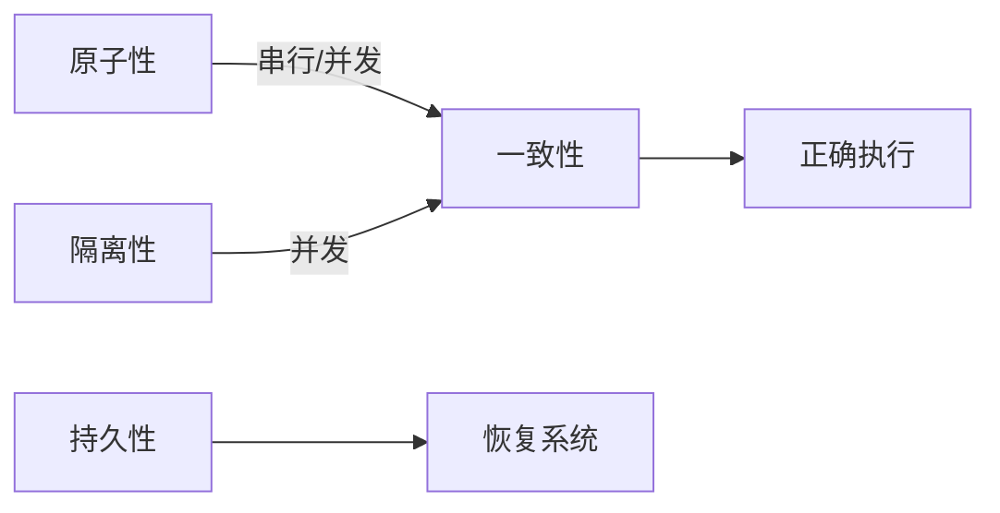

# MySQL

## MySQL索引

InnoDB是MySQL默认的事务型存储引擎，只有在需要它不支持的特性时，才考虑使用其它存储引擎。

实现了四个标准的隔离级别，默认级别是可重复读(REPEATABLEREAD)。在可重复读隔离级别下，通过多版本并发控制(MVCC)+间隙锁(Next-KeyLocking)防止幻影读。

主索引是聚簇索引，在索引中保存了数据，从而避免直接读取磁盘，因此对查询性能有很大的提升。

内部做了很多优化，包括从磁盘读取数据时采用的可预测性读、能够加快读操作并且自动创建的自适应哈希索引、能够加速插入操作的插入缓冲区等。

支持真正的在线热备份。其它存储引擎不支持在线热备份，要获取一致性视图需要停止对所有表的写入，而在读写混合场景中，停止写入可能也意味着停止读取。

### 索引的底层数据结构

InnoDB存储引擎中，索引的底层的数据结构是B+树。

选择B+树的理由：
- B+树是多路搜索树，层级更低，检索更快
- B+树只有叶子节点存储数据，B+树比B树矮
- B+树叶子节点实现双向链表，用于遍历

### 回表

所谓的回表其实就是，当前索引无法得到所有待查找数据，需要通过主键二次查询。

解决方案：使用覆盖索引，为所有待查找数据建立索引，根据该索引得到得到完整数据，无需二次查询。

### 最左匹配原则

如有索引(a,b,c,d)，查询条件a=1andb=2andc>3andd=4，则会在每个节点依次命中a、b、c，无法命中d。

先匹配最左边的，索引只能用于查找key是否存在（相等），遇到范围查询(>、<、between、like左匹配)等就不能进一步匹配了，后续退化为线性查找。

## MySQL事务和锁机制

事务可以使「一组操作」要么全部成功，要么全部失败。事务其目的是为了「保证数据最终的一致性」。

### 事务的特性

- 原子性：事务被视为不可分割的最小单元，事务的所有操作要么全部提交成功，要么全部失败回滚。回滚可以用回滚日志（Undo Log）来实现，回滚日志记录着事务所执行的修改操作，在回滚时反向执行这些修改操作即可。
- 一致性：数据库在事务执行前后都保持一致性状态。在一致性状态下，所有事务对同一个数据的读取结果都是相同的。
- 隔离性：一个事务所做的修改在最终提交以前，对其它事务是不可见的。
- 持久性：一旦事务提交，则其所做的修改将会永远保存到数据库中。即使系统发生崩溃，事务执行的结果也不能丢失。系统发生崩溃可以用重做日志（Redo Log）进行恢复，从而实现持久性。与回滚日志记录数据的逻辑修改不同，重做日志记录的是数据页的物理修改。

### 并发一致性

在无并发的情况下，事务串行执行，隔离性一定能够满足。此时只要能满足原子性，就一定能满足一致性。在并发环境下，事务的隔离性很难保证，因此会出现很多并发一致性问题，比如脏读、重复读、幻读。

解决方案：
- 未提交读（READ UNCOMMITTED）：事务中的修改，即使没有提交，对其它事务也是可见的。
- 提交读（READ COMMITTED）：一个事务只能读取已经提交的事务所做的修改。换句话说，一个事务所做的修改在提交之前对其它事务是不可见的。
- 可重复读（REPEATABLE READ）：保证在同一个事务中多次读取同一数据的结果是一样的。
- 可串行化（SERIALIZABLE）：强制事务串行执行，这样多个事务互不干扰，不会出现并发一致性问题。

该隔离级别需要加锁实现，因为要使用加锁机制保证同一时间只有一个事务执行，也就是保证事务串行执行。

#### MySQL锁

MySQL 中提供了两种封锁粒度：行级锁以及表级锁。

应该尽量只锁定需要修改的那部分数据，而不是所有的资源。锁定的数据量越少，发生锁争用的可能就越小，系统的并发程度就越高。

但是加锁需要消耗资源，锁的各种操作（包括获取锁、释放锁、以及检查锁状态）都会增加系统开销。因此封锁粒度越小，系统开销就越大。

在选择封锁粒度时，需要在锁开销和并发程度之间做一个权衡。

**读写锁**
- 互斥锁（Exclusive），简写为 X 锁，又称写锁。
- 共享锁（Shared），简写为 S 锁，又称读锁。

有以下两个规定：

- 一个事务对数据对象 A 加了 X 锁，就可以对 A 进行读取和更新。加锁期间其它事务不能对 A 加任何锁。
- 一个事务对数据对象 A 加了 S 锁，可以对 A 进行读取操作，但是不能进行更新操作。加锁期间其它事务能对 A 加 S 锁，但是不能加 X 锁。

**意向锁**

使用意向锁（Intention Locks）可以更容易地支持多粒度封锁。

在存在行级锁和表级锁的情况下，事务 T 想要对表 A 加 X 锁，就需要先检测是否有其它事务对表 A 或者表 A 中的任意一行加了锁，那么就需要对表 A 的每一行都检测一次，这是非常耗时的。

意向锁在原来的 X/S 锁之上引入了 IX/IS，IX/IS 都是表锁，用来表示一个事务想要在表中的某个数据行上加 X 锁或 S 锁。有以下两个规定：

- 一个事务在获得某个数据行对象的 S 锁之前，必须先获得表的 IS 锁或者更强的锁；
- 一个事务在获得某个数据行对象的 X 锁之前，必须先获得表的 IX 锁。

通过引入意向锁，事务 T 想要对表 A 加 X 锁，只需要先检测是否有其它事务对表 A 加了 X/IX/S/IS 锁，如果加了就表示有其它事务正在使用这个表或者表中某一行的锁，因此事务 T 加 X 锁失败。